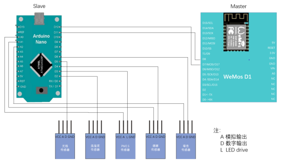
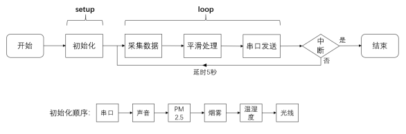
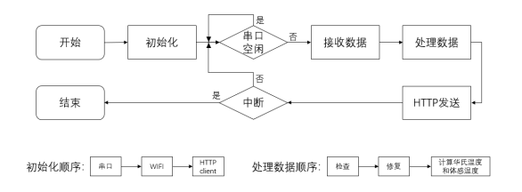

# Homenvi采集端

## 概述

此模块的功能是负责全面地采集温湿度、PM2.5、光线强度、烟雾和有毒气体以及噪音等影响用户生活质量的环境参数。采集模块由两个微控制器和五个传感器组成，其组成结构如图所示

-  Slave节点

此节点是采集模块中的从属节点，其硬件设备为基于ATmega328P 微控制器的Arduino Nano电路板。该节点通过数字和IO引脚连接了五个负责采集前文所述的环境参数的传感器，负责周期性（5s）地向各传感器发起检测命令并接受检测结果值，对这些值做简单的处理后通过软串口的方式将这些数据发给Master节点。

- Master节点

此节点是采集模块中的主控节点，其硬件设备为基于ESP-8266微控制器的WeMos D1电路板。该节点通过软串口与Slave连接，负责接收Slave节点的数据、对数据进行检查、通过采集的数据计算可以得出额外数据，最后通过WIFI以HTTP协议调用服务器接口，将采集的数据发送到服务器。

## 硬件设计

## 软件设计

采集模块的软件开发基于Arduino开发套件，使用C语言作为开发语言。

- Slave节点

此节点的主要功能是控制传感器采集温湿度、光线强度、PM2.5浓度、噪音及烟雾和有毒气体等环境参数，对这些值做简单的处理后通过软串口的方式将这些数据发给Master节点，其程序执行流程如下图所示。

- Master节点

节点负责从Slave节点接收数据、对数据进行检查、做进一步的数据处理，最后通过WIFI将采集的数据发送到服务器，其程序执行流程如图所示。

